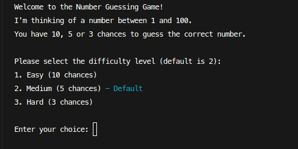
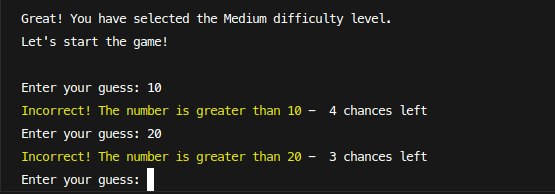
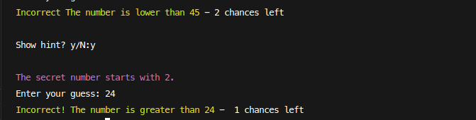
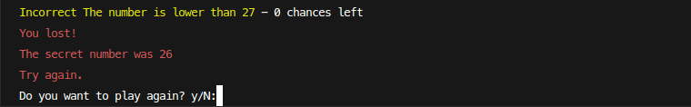

<div align="center">
	<a href="https://github.com/F4eNn/number-guessing-game">
		<picture>
		  
		</picture>
	</a>
</div>
<h3 align="center">Number Guessing Game. Try your luck!</h3>
<div align="center" ><strong><a href="https://roadmap.sh/projects/number-guessing-game">Inspiration</a></strong></div>

</br>

## Features:

- When the game starts, it's display a welcome message along with the rules of the game.
- The computer randomly select a number **between 1 and 100**.
- User should select the difficulty level **( easy, medium( default ), hard )** which will determine the number of chances they get to guess the number.
- The user is able to enter their guess.
- If the guess is correct,the game displays a **congratulatory message along with the number of attempts it took to guess the number**.
- If the user’s guess is incorrect, the game is displays a message indicating whether the number is greater or less than the user’s guess.
- Users are able to play **multiple rounds** of the game until they decides to quit.
- Users also can **track** it's best record.
- The game has implemented a **hint** system.

## Gameplay:

#### Start the game

```bash
./game.php
```

- Displays Welcome message along with rules.



- Try to guess the secret number.



- Don't hesitate to use hints to help yourself along the way.



- Lost? Don't give up! Try again, track your progress, beat your best time, and discover what waiting for you when you win.



## Instalation

1. Clone the repository to your local machine:

```bash
  git clone https://github.com/F4eNn/number-guessing-game.git
```

2. Install dependencies:

```bash
  composer install
```
